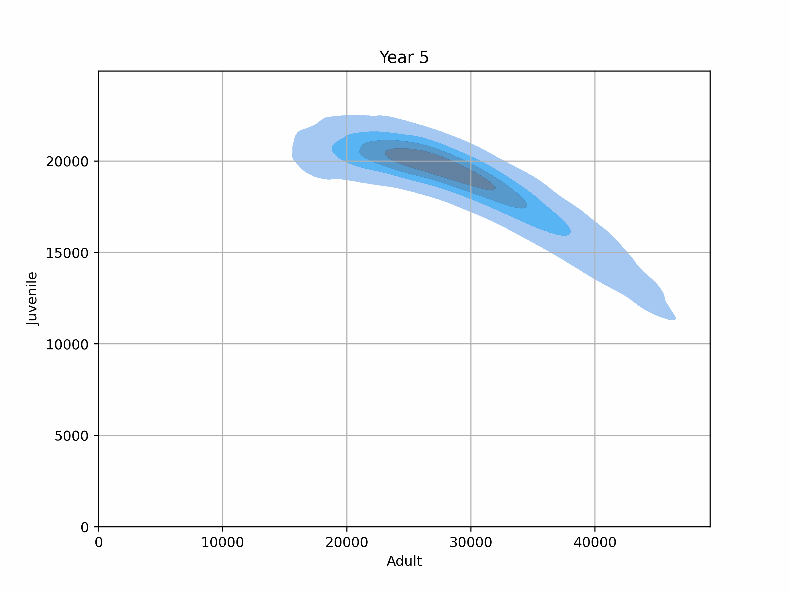
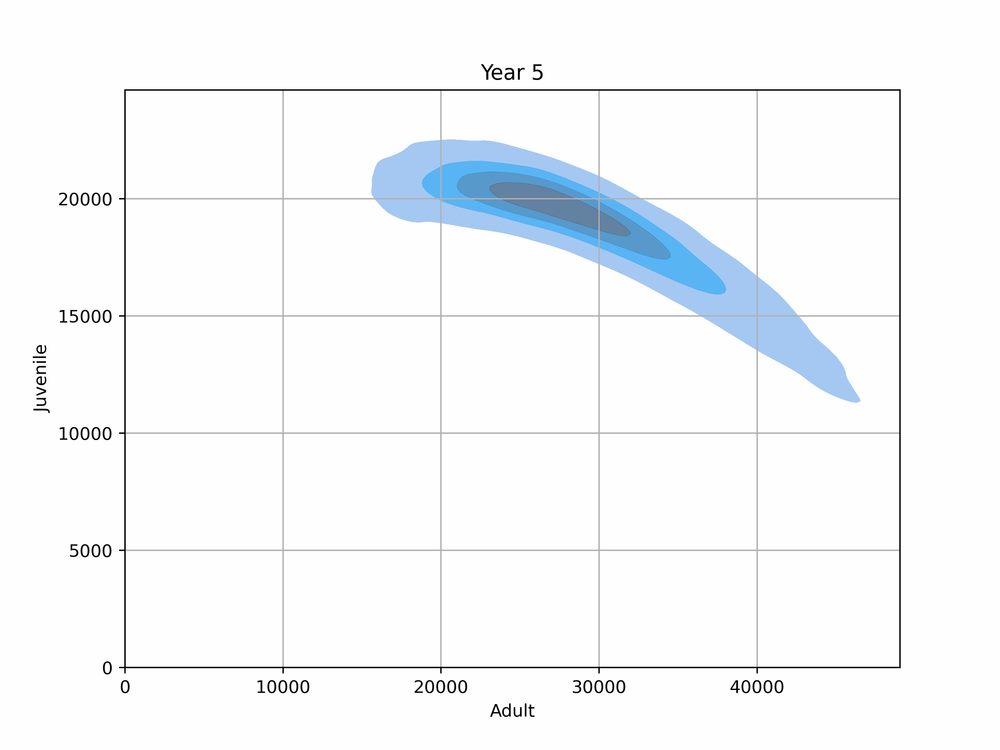

In this repository we share the implementation of the numerical scheme proposed in the article "Age-structured stochastic populations under dynamic  harvesters' behavior: well-posedness, asymptotic stability and numerically-amenable approximations" by M. Isidora Ávila-Thieme, Kerlyns Martínez, Héctor Olivero, Mauricio Tejo, and Leonardo Videla.

  

    
     
    <em>Subsidy = 0</em>
  

  

    
     
    <em>Subsidy = 150</em>
  

  

    
     
    <em>Subsidy = 300</em>
  

