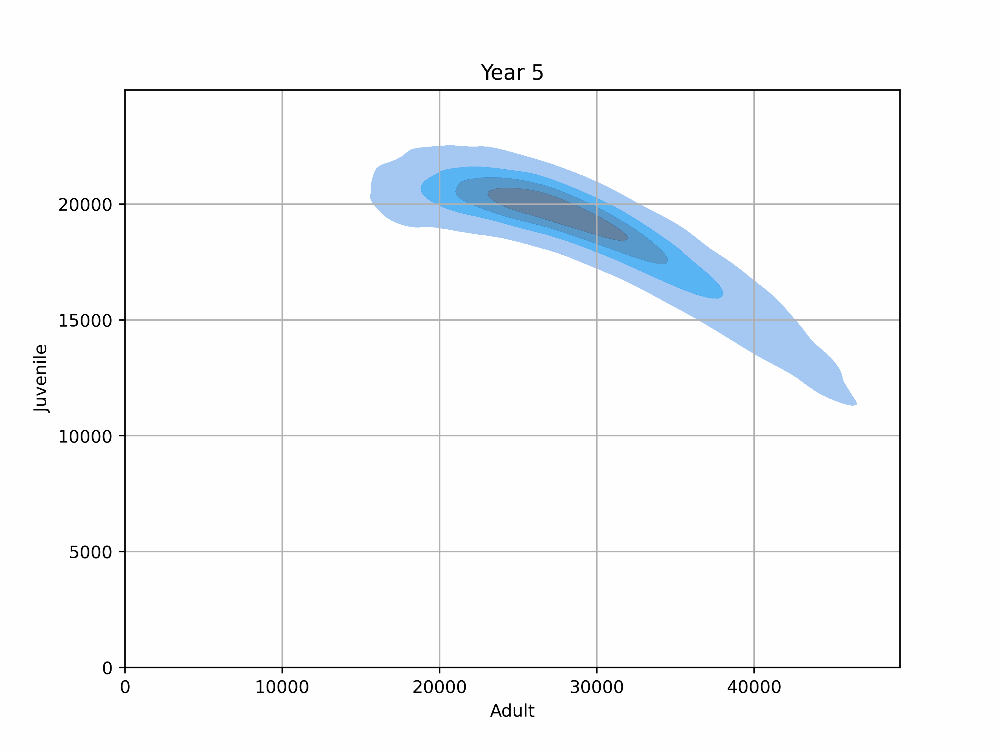
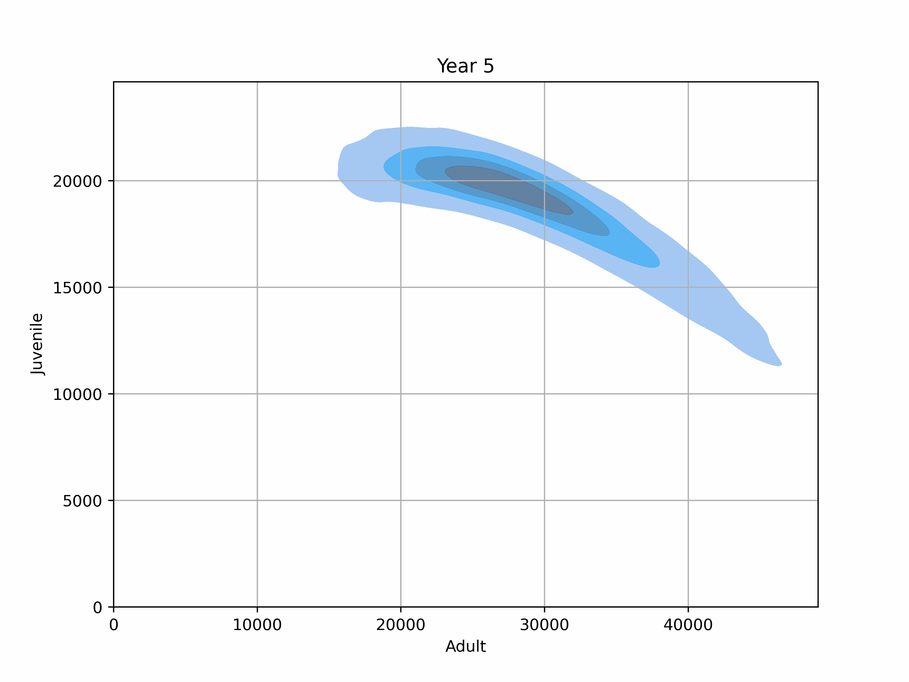
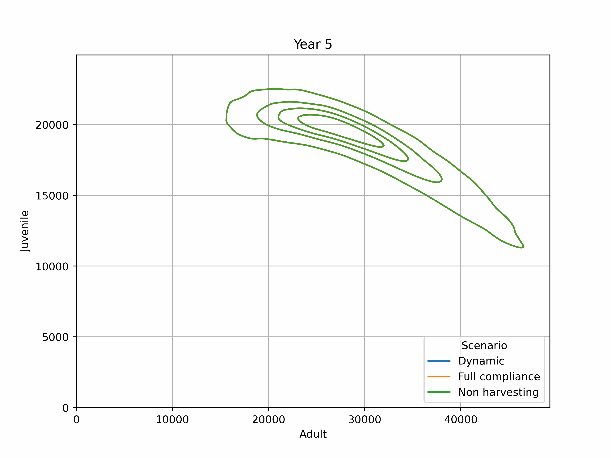
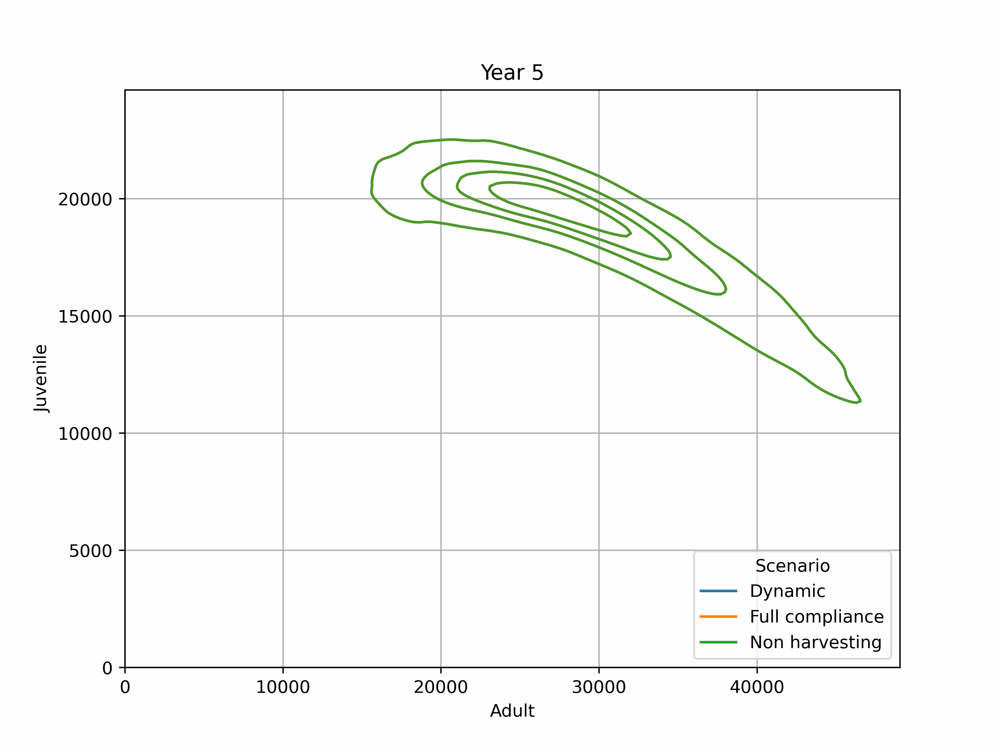
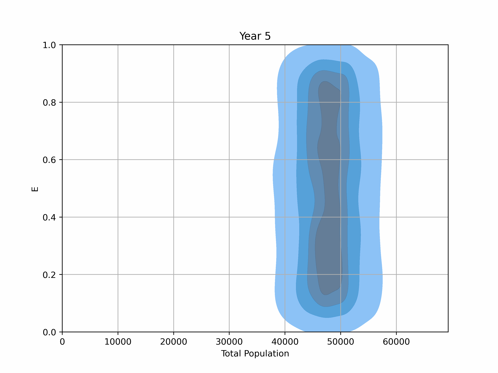

In this repository we share the implementation of the numerical scheme proposed in the article "Age-structured stochastic populations under dynamic  harvesters' behavior: well-posedness, asymptotic stability and numerically-amenable approximations" by M. Isidora Ávila-Thieme, Kerlyns Martínez, Héctor Olivero, Mauricio Tejo, and Leonardo Videla.
## Some animations

Using the script compare_scenarios.py we compare the evolution of the model for different values for the Subsidy parameter. We used three levels: 0 (clp), 150 (clp) and 300 (clp). Bellow we show the output of the simulation.

### Juveniles vs. Adults under harvesting with dynamic compliance

<table>
<tr>
<td>

</td>
<td>

</td>
<td>

</td>
</tr>
<tr>
<td align="center">

Subsidy = 0

</td>
<td align="center">

Subsidy = 150

</td>
<td align="center">

Subsidy = 300

</td>
</tr>
</table>

---

### Juveniles vs. Adults under harvesting with full compliance

<table>
<tr>
<td>

</td>
<td>

</td>
<td>

</td>
</tr>
<tr>
<td align="center">

Subsidy = 0

</td>
<td align="center">

Subsidy = 150

</td>
<td align="center">

Subsidy = 300

</td>
</tr>
</table>

---

### Juveniles vs. Adults under harvesting with dynamic compliance, full compliance and non harvesting

<table>
<tr>
<td>

</td>
<td>

</td>
<td>

</td>
</tr>
<tr>
<td align="center">

Subsidy = 0

</td>
<td align="center">

Subsidy = 150

</td>
<td align="center">

Subsidy = 300

</td>
</tr>
</table>

---

### Complince (E) vs Total population (Adults + Juveniles)

<table>
<tr>
<td>

</td>
<td>

</td>
<td>

</td>
</tr>
<tr>
<td align="center">

Subsidy = 0

</td>
<td align="center">

Subsidy = 150

</td>
<td align="center">

Subsidy = 300

</td>
</tr>
</table>

